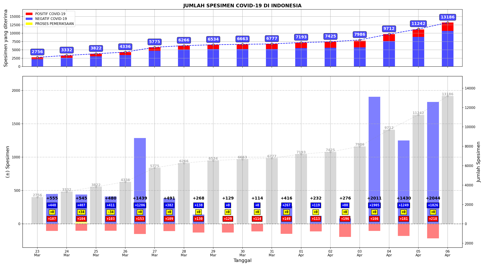

# inkovis


Repo inkovis berisikan modul `inkovis` dan _jupyter notebook_ (buku) yang dapat digunakan untuk memvisualisasikan data infeksi COVID-19 di Indonesia. 

-----

## Notebook

Beriku notebook/pos yang menggunakan modul/dataset inkovis:

### Latar Belakang 

- [[Kaggle]: Visualisasi Data COVID-19 di Indonesia](https://www.kaggle.com/tarumainfo/visualisasi-data-covid-19-indonesia). Visualisasinya menggunakan dataset yang tersedia di kaggle. Pada buku ini juga dijelaskan latar belakang pada pembuatan visualisasinya.
- [[Github]: visualisasi_data_covid19_indonesia.ipynb](https://github.com/taruma/inkovis/blob/master/notebook/visualisasi_data_covid19_indonesia.ipynb). Buku ini serupa dengan Kaggle: Visualisasi Data COVID-19 di Indonesia, yang membedakan hanya dataset dan periode yang digunakan. Dataset menggunakan yang tersedia di repo ini, dan periode yang digunakan adalah 31 hari terakhir. [Lihat buku ini menggunakan NBViewer](https://nbviewer.jupyter.org/github/taruma/inkovis/blob/master/notebook/visualisasi_data_covid19_indonesia.ipynb).


### Kumpulan Grafik

- [[Github]: kumpulan_grafik_31akhir.md](kumpulan_grafik_31akhir.md). Berisikan kumpulan grafik dengan periode 31 hari terakhir.


### Penggunaan Modul Inkovis

- [[Github]: inkovis_nb.ipynb](https://github.com/taruma/inkovis/blob/master/notebook/inkovis_nb.ipynb). Buku ini meragakan fungsi yang tersedia di modul inkovis. [Lihat buku ini menggunakan NBViewer](https://nbviewer.jupyter.org/github/taruma/inkovis/blob/master/notebook/inkovis_nb.ipynb).


-----

## Contoh Grafik

Contoh grafik menggunakan modul inkovis dengan data 15 hari terakhir (harian):

### Kasus Konfirmasi


### Jumlah Spesimen



-----

## Modul inkovis

### Pemasangan

Untuk menggunakan modul inkovis, dibutuhkan dua modul yaitu `inkovis.py` dan `so.py`. `inkovis.py` merupakan modul utama yang berisikan fungsi untuk memvisualisasikan data. `so.py` merupakan modul tambahan yang berisikan fungsi dari orang lain yang digunakan. 

Jika menggunakan jupyter notebook/google colab/kaggle kernel, bisa menggunakan kode berikut: 

```bash
!wget -O inkovis.py "https://github.com/taruma/inkovis/raw/master/notebook/inkovis.py" -q
!wget -O so.py "https://github.com/taruma/inkovis/raw/master/notebook/so.py" -q
```

Atau bisa juga diunduh filenya pada tautan berikut: [inkovis.py](https://github.com/taruma/inkovis/blob/master/notebook/inkovis.py), [so.py](https://github.com/taruma/inkovis/blob/master/notebook/so.py).

### Penggunaan

Fungsi yang tersedia pada modul inkovis meminta input dataset objek `pandas.DataFrame` dan objek `matplotlib.axes.Axes`. DataFrame yang digunakan harus memiliki kolom: `jumlah_periksa`, `konfirmasi`, `sembuh`, `meninggal`, `negatif`, `proses_periksa`. 

Contoh penggunaan:

```python
import inkovis

fig, ax = plt.subplots()

inkovis.plot_confirmed_case(dataset, ax)
```

### Dokumentasi

Untuk saat ini, belum tersedia dokumentasi mengenai penggunaan modul inkovis. 

### Modul `so.py`

Modul inkovis menggunakan potongan kode/fungsi orang lain yang disimpan pada file `so.py`:
- Fungsi `align_yaxis_np()`, [[From Stackoverflow]: Matplotlib axis with two scales shared origin](https://stackoverflow.com/a/46901839/4886384). Menggunakan potongan kode yang disediakan oleh Tim P.

-----

## Dataset

Informasi mengenai dataset bisa baca [dataset/README](dataset/README.md) untuk lebih detail.